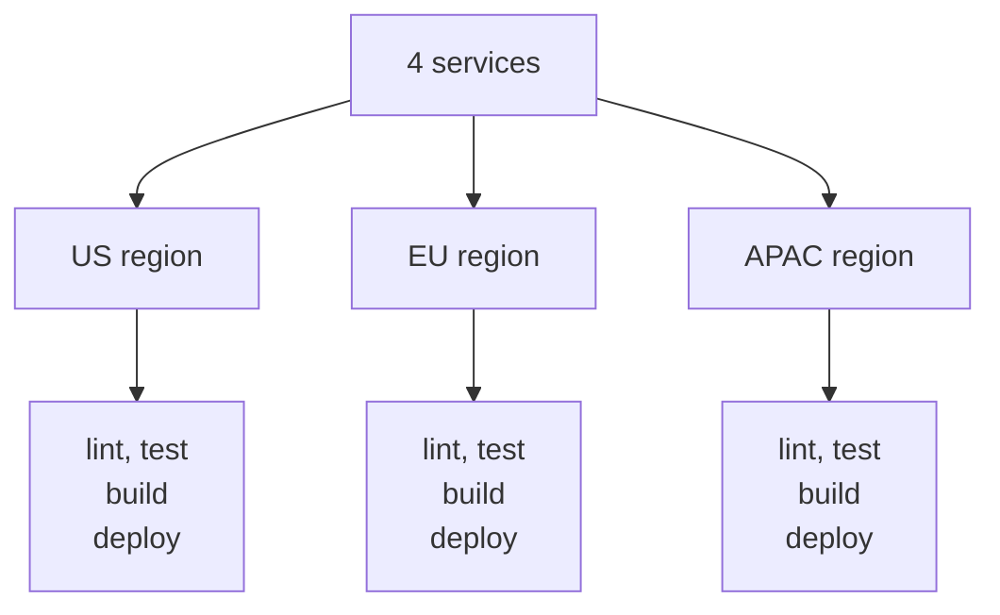
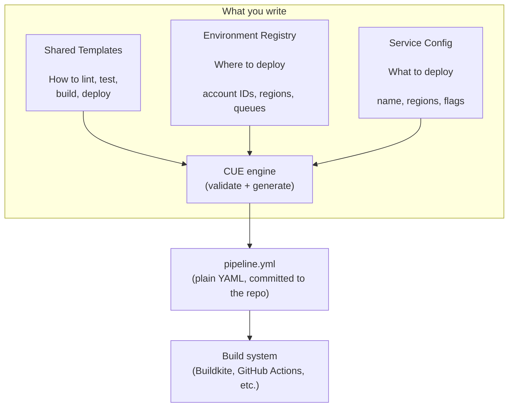
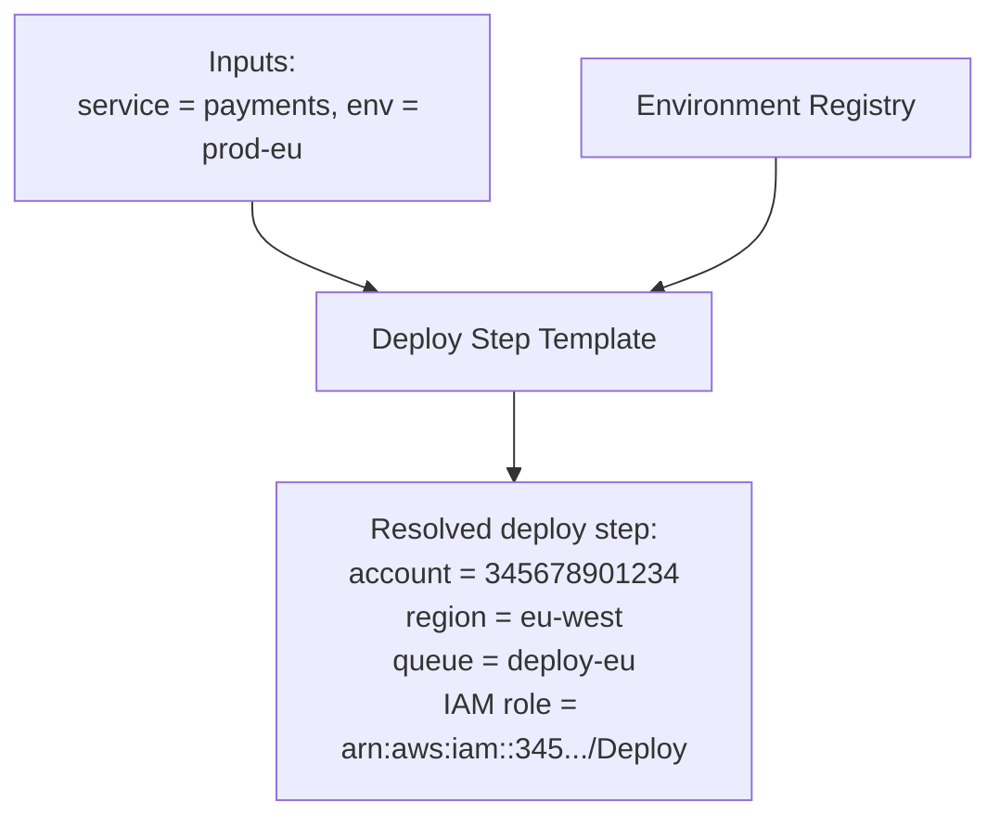
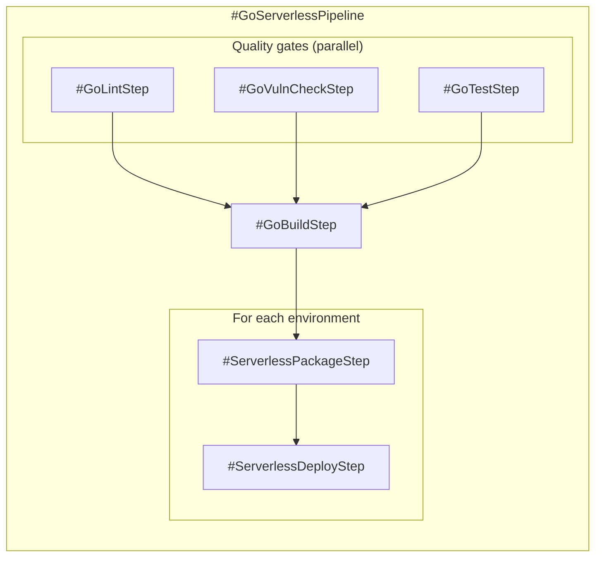
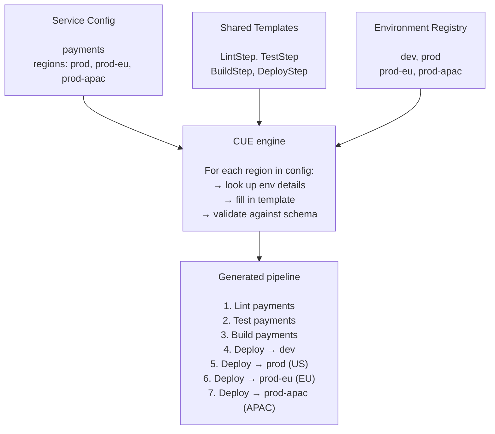
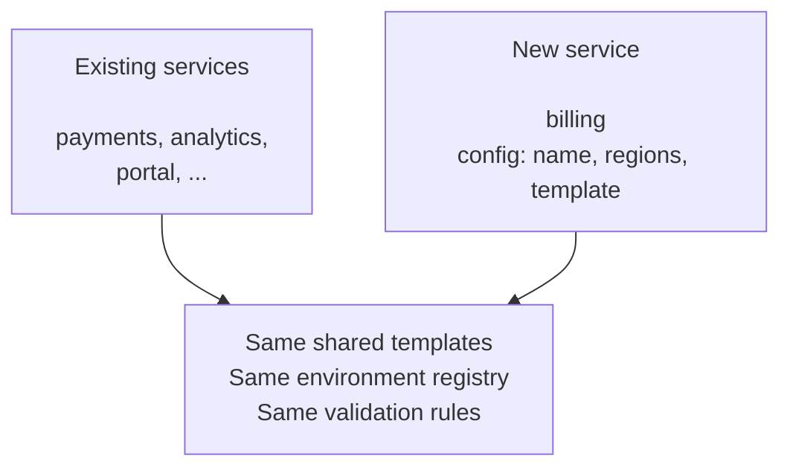
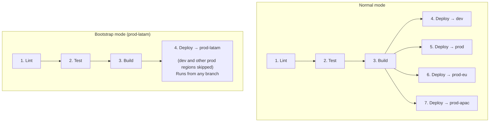

Build pipeline configuration starts simple. One service, one YAML file, a handful of steps. Then you add a second service. A third. A new region. Before long you have dozens of pipeline files, each a slight variation of the same pattern, each drifting in its own direction.

[CUE](https://cuelang.org/) is a configuration language designed to solve this class of problem. It sits between your pipeline definitions and the YAML your build system consumes, acting as a typed template layer with built-in validation. The patterns described here apply to Buildkite, GitHub Actions, or any system that reads YAML.

## The Problem with Raw YAML

Consider a platform with four services deployed across three regions. Each service needs a pipeline with lint, test, build, and deploy steps, and each deploy step varies by region (different cloud accounts, queues, and IAM roles).



With raw YAML, you maintain 12+ nearly identical pipeline files. Common problems:

- **Copy-paste drift.** Each pipeline starts as a copy of another, then diverges in unintended ways. One service gets an updated plugin version, the others don't.
- **No validation.** A typo in an account ID or a wrong queue name won't surface until the pipeline runs in CI.
- **Multiplicative growth.** Every new region multiplies the number of deploy blocks. Every new service copies the whole pattern again.

## The Layered Approach

CUE introduces a generation layer between what you write and what the build system reads. You author CUE files. CUE evaluates them and produces YAML. The build system only ever sees YAML.



The build system never needs CUE installed. It reads the generated YAML files, committed to the repository like any other source file.

## Three Building Blocks

The system is organized around three concerns, each in its own set of files.

### 1. Environment Registry

A single file lists every deployment target: its cloud account ID, region, and which build/deploy queues to use. In CUE, it looks like this:

```cue
// environments.cue

// The schema: what every environment must provide.
// The * syntax sets a default, so most environments
// don't need to specify buildQueue or deployQueue.
#Environment: {
    accountId:   string
    region:      string
    buildQueue:  string | *"build"
    deployQueue: string | *"deploy"
}

environments: {
    dev: #Environment & {
        accountId: "123456789012"
        region:    "us-east-1"
    }
    prod: #Environment & {
        accountId: "234567890123"
        region:    "us-east-1"
    }
    "prod-eu": #Environment & {
        accountId:   "345678901234"
        region:      "eu-west-1"
        buildQueue:  "build-eu"
        deployQueue: "deploy-eu"
    }
    "prod-apac": #Environment & {
        accountId:   "456789012345"
        region:      "ap-southeast-1"
        buildQueue:  "build-apac"
        deployQueue: "deploy-apac"
    }
}
```

When someone adds a new region, they add one entry here. Nothing else in the system needs to know about cloud-specific details.

### 2. Shared Templates

Templates are provided at two levels: **step templates** and **pipeline templates**. Step templates are the building blocks. Pipeline templates compose them into a complete workflow.

#### Step Templates

A step template defines a single pipeline step: how to lint, how to run tests, how to deploy. It accepts a service name and an environment name, then looks up everything else from the environment registry.



Step templates exist for each concern: `#GoLintStep`, `#GoTestStep`, `#GoBuildStep`, `#ServerlessDeployStep`, `#TerraformPlanStep`, `#NodeJSBuildStep`, and so on. Each one encapsulates the plugins, retry policies, timeout settings, and queue logic for that particular action.

#### Pipeline Templates

A pipeline template composes step templates into a full end-to-end workflow for a particular type of service. For example, `#GoServerlessPipeline` wires together lint, vulnerability check, test, build, package, and deploy steps in the right order, with the right dependencies, for every environment listed in the config.



Most services use a pipeline template directly. You pass in your service name and region list, and the template handles the rest, including step ordering, dependency wiring, and per-environment iteration. This is the path shown in the service configuration section below.

#### Dropping Down to Step Templates

Some services have requirements that don't fit a standard pipeline template. They might need custom build steps, additional infrastructure steps, or a different deployment order. These services can skip the pipeline template and compose step templates directly:

```cue
import lib ".pipeline:pipeline"

pipeline: {
    steps: [
        // Use shared step templates for the standard parts
        lib.#GoLintStep & { #service: "sftp", #dir: "sftp" },
        lib.#GoTestStep & { #service: "sftp", #dir: "sftp" },

        // Custom build step specific to this service
        #SFTPBuildStep,

        // Use shared Terraform steps for infrastructure
        for env in config.prodEnvs {
            lib.#TerraformPlanStep & { #dir: "sftp", #env: env }
        },
        for env in config.prodEnvs {
            lib.#TerraformApplyStep & { #dir: "sftp", #env: env }
        },

        // Custom post-deploy verification
        for env in config.prodEnvs {
            #SFTPProbeStep & { _env: env }
        },
    ]
}
```

This service uses shared lint, test, and Terraform steps from the library, but defines its own build and probe steps locally. It gets the benefits of the shared templates (environment lookups, retry policies, plugin versions) while retaining full control over the pipeline structure.

The two levels give teams a choice: use a pipeline template for the common case, or compose individual step templates when you need more flexibility.

### 3. Service Configuration

Each service has a small config file that says: "I am this service, and I deploy to these environments." Then a pipeline file wires it to a shared template.

```cue
// payments/buildkite/pipeline-config.cue

config: {
    service:  "payments"
    prodEnvs: ["prod", "prod-eu", "prod-apac"]
}
```

```cue
// payments/buildkite/pipeline.cue

import lib ".pipeline:pipeline"

pipeline: lib.#GoServerlessPipeline & {
    #pipelineService:  config.service
    #pipelineProdEnvs: config.prodEnvs
}
```

The pipeline template loops over `prodEnvs` and stamps out a full set of steps for each one. The service author doesn't write individual deploy steps. They declare where they deploy, and the template handles the rest.

## How It Fits Together

When the pipeline for a single service is generated, the pieces combine like this:



Each deploy step has the correct account ID, IAM role, region, and queue for its target environment, all derived from the registry. The service author never typed any of those values.

## Expanding to a New Region

Adding a new region is a two-step data change:

**Step 1:** Add the environment to the registry.

```cue
// In environments.cue, add one entry:
"prod-latam": #Environment & {
    accountId:   "567890123456"
    region:      "sa-east-1"
    buildQueue:  "build-latam"
    deployQueue: "deploy-latam"
}
```

**Step 2:** Add it to each service's config.

```cue
// In payments/buildkite/pipeline-config.cue:
config: {
    service:  "payments"
    prodEnvs: ["prod", "prod-eu", "prod-apac", "prod-latam"]  // added
}
```

Run `make pipelines`. Every service that lists the new region gets a complete set of deploy steps with the correct infrastructure details. No templates modified. No YAML edited by hand.

## Adding a New Service

Adding a new service follows the same pattern. Create two small files and regenerate:

```cue
// billing/buildkite/pipeline-config.cue
config: {
    service:  "billing"
    prodEnvs: ["prod", "prod-eu"]
}
```

```cue
// billing/buildkite/pipeline.cue
import lib ".pipeline:pipeline"

pipeline: lib.#GoServerlessPipeline & {
    #pipelineService:  config.service
    #pipelineProdEnvs: config.prodEnvs
}
```

Then run `make pipelines`.

The new service gets lint, test, build, and per-region deploy steps identical in structure to every other service using the same template, inheriting plugin versions, retry policies, timeout settings, and queue assignments automatically.



## Bootstrap Mode: Gradual Rollout

When bringing up a new region, you usually don't want to deploy all regions from a feature branch. You want to deploy only the new region, test it, and merge once it's stable.

A bootstrap mode handles this. Setting a bootstrap flag in the service config changes the generated pipeline.

```cue
// payments/buildkite/pipeline-config.cue during bootstrap
config: {
    service:      "payments"
    prodEnvs:     ["prod", "prod-eu", "prod-apac"]
    bootstrapEnv: "prod-latam"  // activates bootstrap mode
}
```

The template sees `bootstrapEnv` is set and adjusts what it generates:



Once the new region is verified:
1. Remove the bootstrap flag.
2. Add the region to the regular production list.
3. Regenerate.

The pipeline returns to its normal shape, deploying all regions from the main branch.

## Validation and Safety

CUE validates every generated pipeline before it becomes YAML. This catches several classes of errors at generation time instead of at runtime:

| Error type | How CUE catches it |
|---|---|
| Misspelled field name | Schema rejects unknown fields |
| Wrong value type (string where number expected) | Type constraint fails |
| Invalid account ID format | Regex constraint on the field |
| Missing required field | Schema marks it as required |
| Conflicting values between templates | Unification reports a conflict |

A CI step runs `make pipelines` and checks that the generated YAML matches what's committed. If someone edits a CUE template but forgets to regenerate, the build fails with a clear message.

## Testing Pipeline Logic

Pipeline templates contain real logic: conditional steps, dependency wiring, environment iteration, bootstrap mode. That logic can break. CUE has a built-in mechanism for testing it without running any pipelines or external test frameworks.

### How it works

CUE validates by *unification*: if you say a value must be both `10` and `10`, that's fine. If you say it must be both `10` and `8`, CUE reports an error. Tests exploit this by asserting that an `actual` value unifies with an `expected` value.

```cue
_testStepCount: {
    actual:   len(myPipeline.steps)
    expected: 10
    assert:   actual & expected   // fails if actual != expected
}
```

No test runner needed. Running `cue vet -c .` evaluates every assertion in the file. If any conflicts, the command fails with a clear error showing the mismatch.

### Test structure

Test files live alongside the shared templates in a `test/` directory. Each file focuses on one template and groups related assertions together.

```
.pipeline/
  schema.cue
  environments.cue
  pipeline-go-serverless.cue
  steps-serverless.cue
  test/
    pipeline-go-serverless-test.cue   ← tests for GoServerlessPipeline
    steps-serverless-test.cue         ← tests for serverless step templates
    steps-go-test.cue                 ← tests for Go step templates
```

Inside a test file, the pattern is:

1. **Instantiate the template** with a specific configuration.
2. **Query the output** to find specific steps, dependencies, or counts.
3. **Assert** the result matches what you expect.

A single test file typically instantiates the same template multiple times with different configurations to cover different scenarios:

```cue
// Configuration: default (single prod region, tests enabled)
_defaultPipeline: #GoServerlessPipeline & {
    #pipelineService:    "my-service"
    #pipelineProdEnvs:   ["prod"]
    #buildSetupCommands: ["echo setup"]
}

// Configuration: multiple prod regions
_multiRegionPipeline: #GoServerlessPipeline & {
    #pipelineService:    "my-service"
    #pipelineProdEnvs:   ["prod", "prod-eu"]
    #buildSetupCommands: ["echo setup"]
}

// Configuration: bootstrap mode
_bootstrapPipeline: #GoServerlessPipeline & {
    #pipelineService:    "my-service"
    #pipelineProdEnvs:   ["prod", "prod-eu"]
    #buildSetupCommands: ["echo setup"]
    #bootstrapEnv:       "prod-apac"
}
```

Then assertions are grouped by the behavior they verify. For example, testing that bootstrap mode correctly isolates the target region:

```cue
_testBootstrap: {
    // Dev environment is skipped during bootstrap
    bootstrapSkipsDevDeploy: {
        _devSteps: [for s in _bootstrapPipeline.steps if s.key == "deploy-my-service-dev" {s}]
        actual:   len(_devSteps)
        expected: 0
        assert:   actual & expected
    }

    // Existing prod regions are not touched
    bootstrapSkipsExistingProdRegions: {
        _prodSteps: [for s in _bootstrapPipeline.steps
            if s.key == "deploy-my-service-prod" || s.key == "deploy-my-service-prod-eu" {s}]
        actual:   len(_prodSteps)
        expected: 0
        assert:   actual & expected
    }

    // Only the target region gets a deploy step
    bootstrapDeploysTargetRegion: {
        _steps: [for s in _bootstrapPipeline.steps if s.key == "deploy-my-service-prod-apac" {s}]
        actual:   len(_steps)
        expected: 1
        assert:   actual & expected
    }

    // Bootstrap deploys run from any branch, not just main
    bootstrapRunsFromAnyBranch: {
        _steps: [for s in _bootstrapPipeline.steps if s.key == "deploy-my-service-prod-apac" {s}]
        actual:   _steps[0].branches
        expected: "*"
        assert:   actual & expected
    }
}
```

The test names read as behavioral specifications: "bootstrap skips dev deploy," "bootstrap skips existing prod regions," "bootstrap runs from any branch." When a test fails, the name tells you which pipeline guarantee was broken.

### What the tests catch

These tests run during `cue vet` as part of the normal validation step. They catch regressions like:

- A template change that accidentally removes a dependency between steps
- Adding a feature that changes the number of generated steps
- Bootstrap mode including steps it should skip
- A deploy step pointing at the wrong environment's queue or account

Because the tests live next to the templates and run during validation, any change to a shared template is immediately checked against the full test suite before any YAML is generated.

## Build System Agnostic

CUE generates YAML. It doesn't care what reads it. The same approach works for:

- **Buildkite:** generates `pipeline.yml` files with steps, plugins, and agents.
- **GitHub Actions:** generates workflow YAML with jobs, steps, and environment matrices.
- **Any YAML-based system:** GitLab CI, CircleCI, or custom tooling.

The schema changes to match each system's YAML format, but the overall architecture (registry + templates + service config = generated YAML) stays the same.

## Summary

The system separates three concerns, each with a clear owner and change frequency:

| Concern | Who changes it | How often |
|---|---|---|
| **Shared templates** (how to lint, build, deploy) | Platform team | Rarely, when pipeline patterns change |
| **Environment registry** (where to deploy) | Platform team | When adding a region |
| **Service config** (what to deploy and where) | Service team | When onboarding or expanding |

### In practice

In one production codebase using this approach, 18 services deploy across 6 environments (one dev, five production regions on three continents). The shared template library is around 1,500 lines of CUE across 8 files. It generates over 7,000 lines of YAML. Each service's configuration is 6 to 12 lines.

Adding a new region to the nine services that deploy everywhere means changing a single string in each config file. Without CUE, that same change would touch 500+ lines of YAML by hand. The templates are backed by 192 test assertions that run during validation, catching regressions before any YAML is generated.
