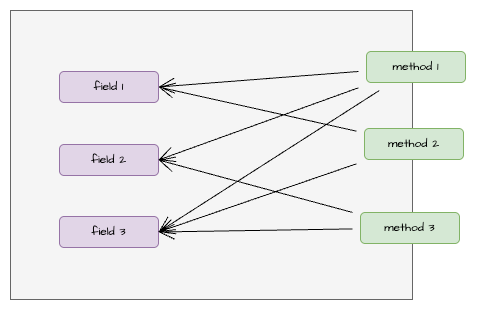
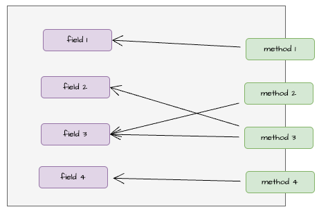

Since working with event sourcing, especially when working with aggregates, I can't resist the feeling that something's contradicting in the way aggregates are modelled. It was not easy to put that feeling into words but I think today I already have some ideas of where that contradicting feeling comes from and hope that this post can captures it.

## Two extremes

First, let's clarify what's an aggregate for? The blue book from Eric Evans has his definition of aggregates which I will not quote again here. To me the most important line is the summary in the Aggregate section of the book:

> Aggregates mark off the scope within which invariants have to be maintained at every stage of the life cycle

In my opinion, that's the essence of aggregates and is the `minimum` reaon why aggregates exist

When we bring this concept into event sourcing, I see 2 different extremes:

- On one extreme, people like to stick with the minimum reason above. Since aggregates for for enforcing invariants and each use case/vertical slice should only touch one aggregate, we only need to think about enforcing invariants in each use case. This leads to degeneration of aggregates and the rise of concept like Dynamic Consistency Boundary (DCB) where it removes the usage of aggregates (.i.e. events are no longer stored in different event streams/aggregates in store) and each use case command handler loads just enough events needed to enforce invariants for that specific use case.
- On the other extreme, people like to group related things (on the surface) together in aggregates (similar to how we used to do object oriented exercises in universitifies and find the nouns in the domain and then find the relationship among them)

I think neither of these is perfect:

- For the 1st extreme:
    - This usually leads to code organisation by use cases in a flat structure. Imagine a folder with hundreds of use cases like below:
    ```
    my-app/
    ├─ usecases/
    │  ├─ use-case-1/
    │  ├─ use-case-2/
    │  ├─ .../
    │  ├─ use-case-xxx/
    ```
    This is not bad per-se but when code grows, it becomes quite difficult to navigate: e.g. if I want to find the logic related to account referral and I haven't touched that code before, I'll have a hard time figuring out what folder in `usescases` it should be in. Is it called `accountreferral`? Is it called `accountcreated`? or maybe `accountopened`? or `referralprocess`? or something else?
    - There are other debates about whether DCB is good (even Greg Young is against it in one of the discussions in LinkedIn). To be honest, I don't know enough about it to say whether it's good or bad. But the reason above alone already convinces me that it's not something that we should pursue without adjustments
 - For the 2nd extreme:
     - This often (not always) leads to huge aggregates. I actually encounter this in my current project where an `Account` aggregate can have 40-50 methods for different use cases. This is not unusual if we think about what we usually do when adding a new logic: we would naturally look into existing aggregates and see whether there is one that "feels" close enough with the new logic and stuff the new logic in there. This accumulates over time. How do we determine that an existing aggregate is similar to the new logic? By feeling? By experience? We can't be right about the decision (to put the new logic in a specific aggregate) every time, so there'll be logic misplaced and that's why the aggregates grow bigger and bigger. There are already enough discussions on the disadvantages of large aggregates so I'll not repeat them here

## Use case driven aggregates
  
I think we need something else, something in the middle of above 2 extremes. I would call that use case driven aggregates:

> Disclaimer: these are just my opinions and I believe it's nothing new, many other people should have similar thought process and they may call it differently

when working with event sourcing, we need to resist the temptation of finding objects/nouns and group related objects together like how we model object-oriented systems. Event sourcing (the command side) is use case/vertical slice driven (as in each use case is represented by a command, our focus is to handle the command and maintain invariants) by nature. We should always start with an use case and determine the invariants. Based on the invariants, we group related use cases together into aggregates (create new one if needed). The preference is to keep aggregates small, just enough to enforce invariants. In other words, use cases first, aggregates second. Aggregate is just a way to group similar use cases for organisation purpose. The difference with the 2nd extreme above is that since we start with use cases, our mind is not fixed on specific aggregates and not trying to bend the logic to fit an existing aggregate. We are also more liberate to create new aggregates as we see fit here

> this is the reason for my contradicting feeling that I mentioned. Coming from object-oriented background, I have a tendency to model things the object-oriented way, have relationships among objects, try to make them smart. But taking that modelling to the extreme is contradicting with the use case driven nature of event sourcing. Event sourcing doesn't put a lot of focus on modelling objects and their relationship but more on invariant enforcement. I'm not saying there's absolutely no need for object-oriented modelling. That might comes when an use case becomes complicated (which might be an indication that the use case can be broken down into smaller slices?), but the point is it's secondary and shouldn't be used by default to design aggregates.

## Bonus point

When judging aggregate size, I find it useful to assess the aggregate cohesion, .i.e. whether all the methods in an aggregate use all the internal fields consistently? Or there are some groups of internal fields that are accessed execlusively by some methods?

In other words, we would like to see more of this



not this



for the latter, we might have 3 different aggregates instead of 1

Having said that, are we able to use this to avoid the need of aggregate restructuring? I would say it's quite difficult . Code evolves, requirements change. At the beginning, things look good, but when we discover more and more changes are introduced, our initial decision might be wrong. That's why I think we need to:

- assess aggregate cohesion aggressively after new logic added and split aggregates early
- have a way to fix the wrong decision easily. This is one reason that DCB approach wants to move away from aggregates. They argue that aggregate structure is too rigid. Once events are emitted, it's difficult to restructure events (.e.g. move events to different aggregates/event streams, join streams)

## Summary

- Aggregates are still needed, but we should put focus on modelling use cases first. Aggregates become organisation structure for related use cases/invariants
- Aggregate cohesion is an important factor to consider when grouping logic or splitting aggregates into smaller ones