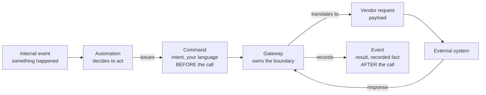

When an automation calls an external system, the command is the **intent** to make that call, decided before the call and written in your own language. The call itself, the request you send the vendor, and the response you get back are three other things. Conflating them is the most common modeling mistake at the boundary.

This article applies to interactions that *cause an effect* in another system: sending an email, charging a card, creating a shipment. Reading from an external system is a different shape, covered at the end.

## The four things people merge into one

Calling an external system has a lifecycle, and each stage is a distinct concept.



- **Command:** the intent. "Send this reply." Imperative, in your vocabulary, and able to be rejected. It exists before anything leaves your process.
- **Execution:** the gateway actually making the call. This is the side effect, not the command. It is the command being *handled*.
- **Vendor request payload:** the provider's wire format, built from the command. An artifact of translation, downstream of the command.
- **Result:** the outcome, which you record as an **event**. A fact, past tense, that the interaction happened or failed.

So: command before, event after, vendor payload in between, the call is just execution.

## The command is intent, not action

A command is a request to change state that a handler can accept or reject. That definition does not change when the state lives in someone else's system. The command still names what you want, in your terms:

```
SendReplyEmail {
  conversationId,
  to,
  subject,
  body,
  idempotencyKey
}
```

It is not "the act of calling the provider." That act is what happens when the command is handled. The distinction matters because the command is the thing you can store, queue, retry, authorize, and test, all without any network call having happened yet.

## The handler is a gateway, not an aggregate

In ordinary CQRS a command is addressed to one of your aggregates, which enforces an invariant and emits an event. At an external boundary the handler is a **gateway** that owns the integration instead. The message is still a command. Only the handler's nature differs.

The gateway is where vendor specifics live, and nowhere else. It accepts your domain command, turns it into the provider's request, makes the call, and records the result as an event. That isolation is the point: the rest of your system speaks its own language, and the vendor's language stops at the gateway.

## Keep the vendor's shape out of the command

The request payload is a **translation** of the command, produced inside the gateway. It belongs to the provider's API, not to your model. This is the anti-corruption boundary.

The test is simple. If you swapped email providers tomorrow, the command should not change. Only the gateway's translation step should. If the provider's field names, content structure, or quirks have leaked into your command, you have coupled your domain to a vendor you do not control.

- Command: your fields, stable across providers.
- Payload: their fields, rebuilt by the gateway per provider.

## The result is an event, and that is what makes it first-class

The response is not the command and not a return value you throw away. You record it as a domain event:

- `ReplyEmailSent { conversationId, providerMessageId, at }`
- `ReplyEmailSendFailed { conversationId, reason, at }`

Recording the outcome as an event does three jobs at once.

- **Audit:** the interaction is now part of your history, with the provider's identifier captured for reconciliation.
- **Idempotency:** before calling, the gateway can check whether a "sent" event already exists for this command and skip the duplicate.
- **Replay safety:** when events are reprocessed, the recorded result lets the gateway recognize work already done and avoid sending again.

This is also the answer to the dual-write problem. You cannot atomically "make the call and record that you made it" across two systems. So you separate the steps: record the intent durably, execute, then record the result, and dedupe on the idempotency key. The command and the event are the durable bookends around an action that is not transactional.

## Failure is a fact, not an exception

Because the result is an event, a failed call is a recorded fact, not a stack trace that vanishes. `ReplyEmailSendFailed` is a domain event like any other. An automation can react to it: retry with backoff, escalate to a human, or compensate elsewhere. Modeling the failure as an event is what lets the rest of the system respond to it deliberately, instead of hoping a retry loop somewhere caught it.

## Reading is not a command

Everything above is for calls that cause an effect. Reading from an external system, a price lookup, an address validation, a balance check, causes no state change, so there is no command. That is a query. Its result feeds a read model or informs a decision, and it produces no event of its own unless you choose to record the reading as a fact.

If you find yourself wanting a command for a pure read, check whether the call really has a side effect. Usually it does not, and the command disappears.

## The takeaway

Model two things as first-class, and quarantine the third.

- **Command:** the intent, before the call, in your language. Durable, rejectable, idempotency-keyed.
- **Event:** the result, after the call, as a recorded fact, including failure.
- **Vendor payload:** the translation, confined to the gateway, never leaking into either.

The call itself is just the gateway handling the command. When the command carries your intent and the event carries the outcome, the external system becomes an ordinary part of your event-sourced model, replayable and auditable, instead of a hole in it.
