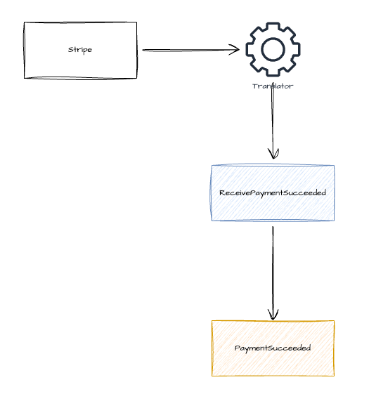
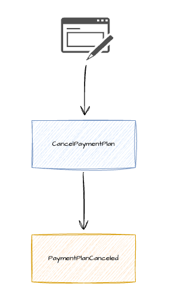
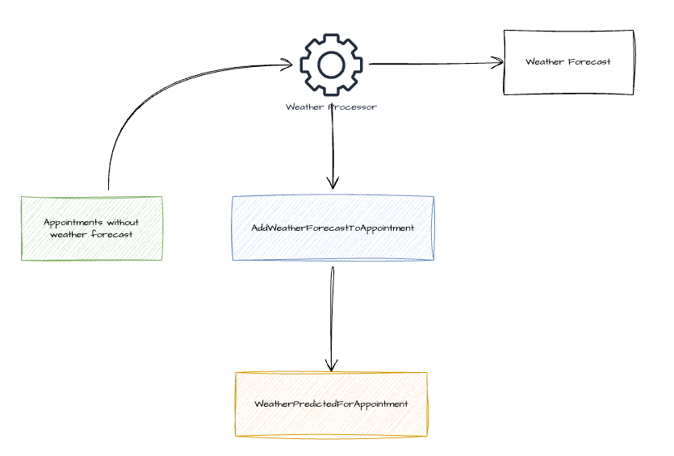
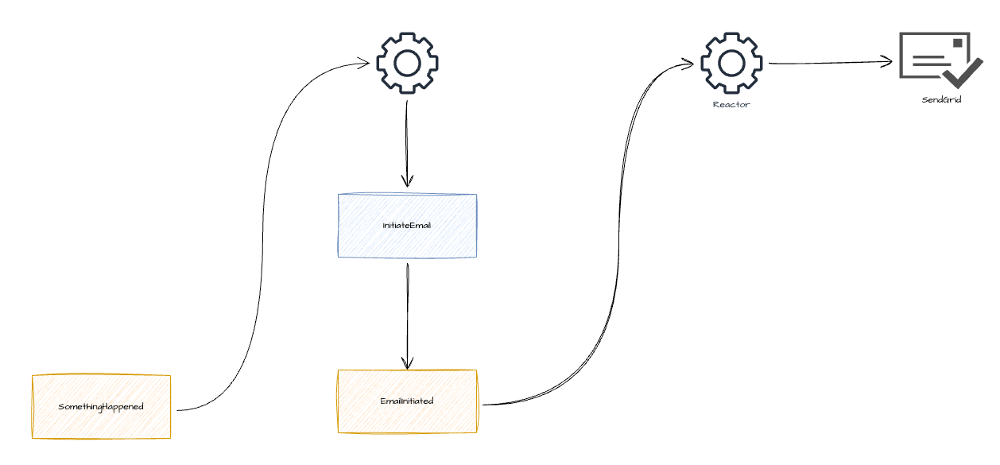
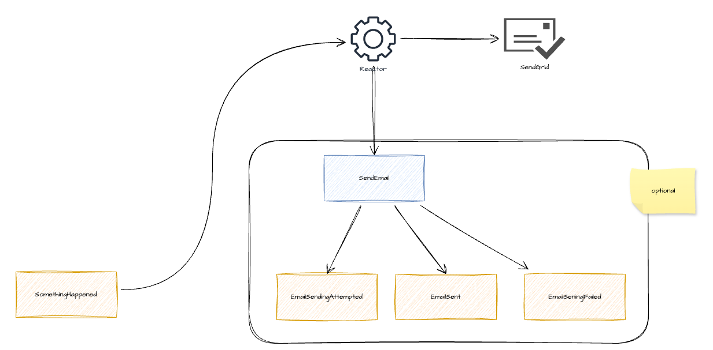

I have been working day-to-day with an event-sourced system in the past 1 year and I must say I really enjoy it. This is the 1st blog post among several that I plan to write about the insights I gained throughout the year

This post is about how we model external interactions (especially outbound interactions) in an event-sourced system. This has always been an area that I'm interested in exploring more since most of the materials that I have read on event sourcing don't talk about this in depth

## Types of external interactions

First, let's categorise a few different interactions between a system and its external dependencies:

- `Inbound event notification`: e.g. Stripe calls a webhook in our system to inform us about a payment status. This is usually handled by a translator that translates external requests into internal events

- `Inbound command`: e.g. users click on a button in a web page to cancel their payment plan. Our system receives the request and issues a command to cancel the payment plan, which may lead to an event. Note the difference between this and the inbound event notification above:
    - when the system receives the inbound event notification, the external event already happened in the external system and we are not able to reject it. The external system just tells us about it, not asking our opinion
    - when the system receives the inbound command, it needs to ensure all the invariances are satisfied when processing the command. It can reject the command when an invariance is broken

- `Outbound query`: automations/processors (terminologies from event modelling) make queries to external systems to retrieve some information before issuing commands. An example is as below where the weather processor makes a call to the external system (weather forecast) before issuing a command to add the forecast to the appointments (this example is from [event modelling cheat sheet](https://eventmodeling.org/posts/event-modeling-cheatsheet/cheatsheet.jpg))

- `Outbound command`: causes side effect in external systems, e.g. sending emails with SendGrid, calling Stripe API. This is my main interest and what this blog post focusing on. In this blog post, I'll use sending emails as primary examples for external outbound interactions

## Should we model an external outbound interaction?

By modelling I mean modelling the interaction and store those events in the event store. This seems like a question with an obvious answer, but it actually tripped me at the beginning. When working with non event-sourced systems that are architected with onion/hexagonal/clean/functional core architecture, I was trained to separate domain logic from infrastructure concerns like sending emails, writing to database, so naturally when coming to event sourcing, I thought those infrastructure concerns shouldn't have their own dedicated events like `EmailSent`, because why do we have infrastructure-related events in our domain event store? Take an example of sending user activation email after registration, we should just have a reactor that listens to the non-infrastructure related domain event `UserRegistered` and invokes SendGrid to send an activation email right?

However, I come to realise that sending emails can be part of the domain. Business stakeholders do talk about sending activation emails as a feature. They don't care about implementation details (.i.e. whether we use SendGrid or other provider to send emails) but they do care about whether emails are sent out and users can activate their accounts through those emails. So there's nothing wrong with having events like `ActivationEmailSent` in the domain event store. There can be business requirements based on this event, e.g. providing a report on how long in average users take to activate through emails.

Having said that, I do believe that this is case by case and not all the situations require email sent events. This comes back to why we store events in event sourcing systems. For me, one of the primary reasons is so that we can make decisions based on those events later. If there's no business requirement that requires email sent events like above example, we don't need to model and store those events. In the system that I'm working on, we need to send emails to users when Stripe tells us about their payment status (succeeded/failed). Since the emails are just for notification and we don't need to do anything further beyond that, we don't model and store email sent events in this case.

## How do we trigger an external outbound interaction?

### Use ...Initiated events

In the system that I'm working on, we usually use events like `EmailInitiated` to trigger a reactor (an automation/processor that performs operations with side-effect) like below:

In my opinion, this approach is not ideal because:

- Initiated events don't carry significant business values: business stakeholders are most probably not interested in whether we start/initiate the email sending process. They are more interested in whether the email is sent, whether the email is delivered. These `...Initiated` events seem to be created just for technical purpose (triggering email sending)

>  another way that I usually do to validate whether events are meaningful is to imagine myself describing the process to a non-technical business stakeholder, or imagine myself being the stakeholder. Are these events the terms that I'm going to use in the conversation?
>  - here's an example inspired from my current system that uses `...Initiated` event:
>    - After `AccountReferred` to our system, we are legally required to inform the users about this referral (users are different from the one referring the accounts). We do this by either email (`ReferralNotificationByEmailInitiated`) or letter (`ReferralNotificationByLetterInitiated`), based on user's country and address
>    - We then schedule email sending to the next compliant time (.i.e. working hours)
>    - When the scheduled time comes, a reactor is triggered, which sends the email
>  - here's a different modelling approach which don't use `...Initiated` events
>    - After `AccountReferred`, `ReferralNotificcationChannelSelected`. Notice that here we focus on recording result of an action with a business impact that we did (select a channel based on user's country and address), rather than on initiating email sending process
>    - Then `ReferralNotificationScheduled` (to the next compliant time)
>    - When the scheduled time comes, a reactor is triggered, which sends the email and records `ReferralNotificationSent`
>
>  personally, the 2nd approach sounds much more natural and closer to a conversation with a business stakeholder

- Second reason is probably more subjective. I always feel `...Initiated` events are [passive-aggressive](https://sarahtaraporewalla.com/architecture/commands-not-passive-aggressive-events) events, in the sense that when we emit those events, we are not focusing on recording something that happened. We are expecting another process to pick them up and continue with the email sending. They are commands in disguise to me. To be honest, this can be argued other ways too, .e.g. the events are recording a process being started - that's true, and I can't argue against that (without going back to 1st reason above). That's why I think this is more of a personal preference.

### Use ...Sent events

How about using an event like `ReferralNotificationByEmailSent` to trigger email sending? I don't think this is any better than the previous approach. We are talking about an exernal system that is not under our control. There can be unexpected things happening after the events are persisted and a reactor is triggered to send requests to the email provider, .e.g. the email provider is down for longer than our retry policy. Are we lying when saying that email is sent but it's actually in our dead-letter queue?

> Can we just re-drive the DLQ and send those emails when the provider is online again? We can, but what if after their incident, the email provider has their internal state messed up and requires all the emails to be updated to use a different value/version for a field? I don't know whether this can actually happen, but my point is that it's a system that we don't control, we shouldn't make claims before we are sure

### What to use then?

In my opinion, we shouldn't have dedicated events just to trigger external interactions. External interactions should be triggered by domain events like any other use case, e.g.

- `PaymentSucceeded` -> send payment succeeded email
- `ReferralNotificationChannelSelected` -> send referral notification email

If we need to use `...Initiated` events to trigger external interactions, we probably miss something in the modelling

## How an ideal external interaction looks like (to me)?

1. A reactor is triggered by a business event
2. (Optional) It emits `EmailSendingAttempted`
3. It makes the call to SendGrid to send the email
4. (Optional) It issues a command with result of SendGrid call
5. (Optional) The command handler emits either `EmailSent` or `EmailSendingFailed`

We should decide case by case whether to emit the 3 events `EmailSendingAttempted`/ `EmailSent`/ `EmailSendingFailed`, depending on our need as mentioned above.

There's a potential problem with this though: what happens if the reactor dies after step 3 (.i.e. events are not perisisted to store yet)? This is a hard problem to solve since we can't guarantee atomic transaction between SendGrid and event store. How about using outbox pattern (.i.e. persist events first and have another process to send emails based on those events)? That is back to my previous argument on not using `...Sent` events for triggering, so to be honest I don't like it that much. I think we may have to accept that:

- It's possible to have duplicate emails sent (.i.e. as long as we don't have `EmailSent`/ `EmailSendingFailed`, we can retry sending)
- the chance of this happening is small enough that we can ignore
