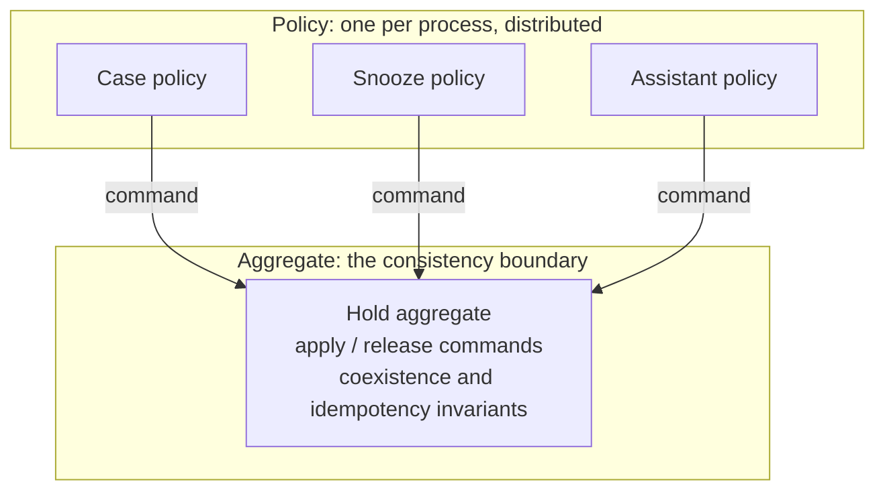
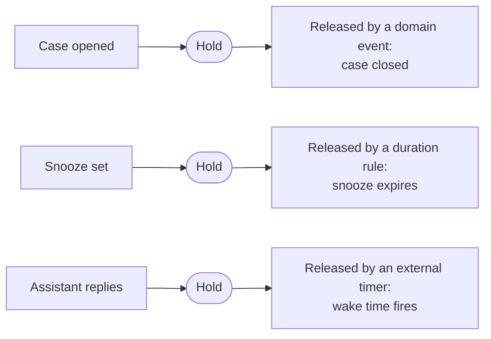
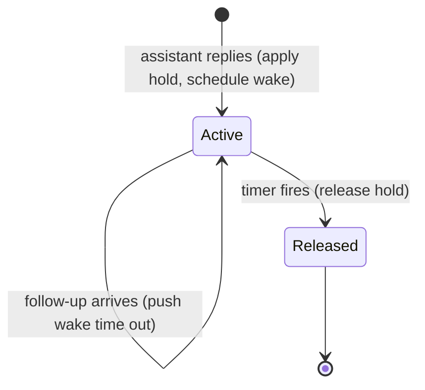

A recurring design question in event-sourced systems: a new event needs to trigger an effect that some existing reactor already produces. A reactor is the component that subscribes to events and reacts by issuing commands. Do you extend that reactor, or write a new one?

This article uses one running example. Imagine a system that can place a customer on **hold**, which pauses all outbound messages to them. Several situations cause a hold:

- A support case is opened. Hold until the case is closed.
- The customer asks to be snoozed for a while. Hold until the snooze expires.
- An automated assistant replies to the customer. Hold for a cooling-off window so a human-sounding bot and the marketing engine do not talk over each other.

A reactor already exists that handles the first two. It listens for case and snooze events and applies or releases the hold. The third situation is new. The tempting move is to centralise: one reactor that owns all hold handling. This article argues that the tempting move is usually wrong, and gives a rule for telling when it is not.

The example is holds, but the reasoning applies to any effect that more than one part of a system wants to trigger.

## Aggregate vs policy

The word "centralise" hides two different things you could be centralizing.

- **The aggregate:** what a hold *is*. The invariants it enforces, reached through the apply and release commands: re-applying an active hold does nothing, and only certain holds may coexist.
- **The policy:** when and why each source decides to pause. Case opened, so hold. Snooze set, so hold unless it expires today. Assistant replied, so hold for a window.

The aggregate is already centralised, by definition. It owns the hold state, and it is the single authority on what a hold is and which holds can stack. This is not a stylistic choice. The aggregate is the consistency boundary, so its invariants have to be enforced in one place. Any reactor that wants to pause a customer issues a command to that same aggregate.

So the part that genuinely benefits from centralization is already centralised. The reactor does not own what a hold is. It is one policy that issues a command to the aggregate.

The aggregate is the one box at the bottom. The policies are many, and they do not belong together just because they all issue commands to it.

"Centralise all hold handling" therefore means something narrower than it sounds. It means centralise every *policy*, every trigger, into one component. That is the move to examine.

## State vs process

A hold is not a process. It is a state that several processes each touch.

This distinction decides the design. A process is a flow with identity, internal state, and a beginning and an end. Handling a support case is a process. Running a snooze is a process. Conducting an automated conversation is a process. Each of those, as one of its steps, happens to pause outbound messages.

Organizing a component around "everything that produces a hold" groups code by a shared side effect, not by a process. An analogy makes it obvious. Sending email is also something many flows do. Nobody builds a single component subscribed to every event in the system that might want to send mail. You expose a mailer and let each flow call it when its own logic says so. Holds are the same. The apply command lives on the aggregate. Each process issues it.

Grouping triggers by their shared verb is the god-object smell, dressed up as cohesion.

## The lifecycle test

Here is how to tell whether triggers belong together. Look at how each one releases, and what holds its state.

In the example, three sources pause the customer, and no two share a shape:

- **Case hold:** applied when a case opens, released when the case closes. The state lives on the case itself. The reactor can be stateless because the case remembers everything.
- **Snooze hold:** applied or released by duration logic. The state lives on the snooze.
- **Assistant hold:** applied when the assistant replies, released by a timer at a future wake time, and extended whenever a follow-up arrives before the timer fires.

Three different keepers of state. Three different release signals. One is a domain event, one is a duration rule, one is an external timer.

A second signal is correlation. A real coordinating component is keyed by one process instance and tracks it to completion. What would a centralised hold component be keyed by? Not the customer. Multiple holds can sit on one customer at once with independent lifecycles, and the customer stays paused until all of them release. There is no single instance per customer to track.

When the release signals diverge and there is no shared correlation key, the triggers are separate processes that happen to share a side effect. Merging them produces three coordinators wearing one struct, joined only by the word "hold."

## When centralizing is right

Centralizing is not always wrong. Homogeneous policies can share one reactor.

Homogeneous means the same shape:

- Triggered by events from the same source aggregate.
- Released by the same kind of signal.
- Target resolved the same way.

The case and snooze holds in the example fit this. Both react to events on the customer's own stream. Both find the target the same way. Both release on a domain event. Grouping them in one reactor is fine, because they are alike. A handler-per-event-type map over homogeneous rules is a convenience, not a god object.

The assistant hold breaks all three conditions. It is triggered by a different source. It finds its target indirectly, through data carried on the event rather than the event's own identity. It releases on a timer, not a domain event. It does not fit even under a centralizing philosophy, because it is not like the things already there.

So the rule is not "always split" or "always merge." It is this: **same source and same release shape can share a reactor. A different source or a different lifecycle gets its own.**

## Is a process manager the right answer

Sometimes the centralised handler gets reframed as a process manager, on the grounds that it coordinates the whole hold lifecycle. The reframing backfires, in an instructive way.

A process manager owns one process: a flow with state and a lifecycle, advancing as events arrive. By that definition, the existing case-and-snooze reactor is not a process manager at all. It is stateless rules. Event in, command out, no memory. The state lives on the aggregates it reacts to.

The assistant hold is the one piece that actually looks like a process:

It has identity, the conversation it belongs to. It has accumulated state, the current wake time. It has a real end. If you want to apply the process-manager pattern anywhere in this picture, this is where it earns its keep.

That inverts the original argument. The process-manager lens does not justify folding the assistant hold into the existing rule bag. It argues for giving the assistant hold its own component, because it is the only flow with genuine process state. Burying it among stateless rules dilutes the one place the pattern fits.

## Serving the real motive

The instinct to centralise usually comes from a good place: a wish for one place to answer "what can pause this customer?"

You can have that, and it does not require one reactor. It comes from the vocabulary, not the call site. A single enumerated list of hold reasons, and a naming scheme for the identifiers each source uses, is the canonical catalog of why a customer can be paused. Adding an entry is what makes a new source discoverable. You get the one list from shared definitions, without routing unlike processes through one handler.

Discoverability is a property of the shared vocabulary, not of where the code runs.

## The takeaway

Split the question into three layers and the answer falls out:

- **Aggregate:** centralise it. The aggregate that owns the state is the one authority on what the effect is and how its invariants hold.
- **Vocabulary:** centralise it, in shared definitions. One catalog of reasons and identifiers, reused by every trigger.
- **Policy:** do not centralise by default. Each trigger is part of a different process with its own lifecycle. Let it live with that process.

Reuse the aggregate's commands and the vocabulary. Give each distinct process its own reactor. And when a trigger has real multi-step state and a timer, that is not a reason to merge it into the pile. That is the one case that deserves a process manager of its own.
